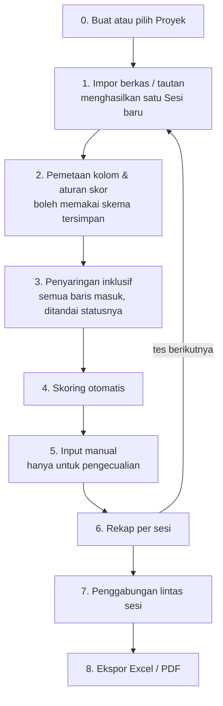

# FormScoring Engine — Dokumen Desain

|                  |                                                                       |
| ---------------- | --------------------------------------------------------------------- |
| **Tanggal**      | 27 September 2026                                                     |
| **Status**       | Disetujui untuk perencanaan implementasi                              |
| **Menggantikan** | PRD v1.1 (27 September 2026) pada bagian-bagian yang disebutkan di §2 |

---

## 1. Ringkasan

Aplikasi web untuk mengubah jawaban form (Google Forms, Excel, CSV) menjadi nilai akhir yang terhitung otomatis, konsisten, dan bisa dipertanggungjawabkan.

Inti sistemnya bukan "aplikasi penilaian", melainkan **mesin skoring generik**: setiap kolom spreadsheet diberi satu aturan skor, dan aturan itulah yang menentukan bagaimana jawaban berubah menjadi angka. Satu konsep ini menampung dua jenis penilaian yang berbeda sifatnya — tes berkunci jawaban dan survei skala Likert — tanpa membangun dua aplikasi terpisah.

Beberapa tes yang diunggah untuk kelompok orang yang sama dinaungi satu **Proyek**, lalu digabungkan menjadi satu spreadsheet yang dapat diunduh.

### Keputusan utama

| Keputusan                                   | Isi                                                            |
| ------------------------------------------- | -------------------------------------------------------------- |
| **AI tidak dipakai** untuk menghitung nilai | Lihat §3                                                       |
| **Penyimpanan**                             | Google Sheets + Apps Script Web App                            |
| **Aturan skor per kolom**                   | `peta-opsi`, `kunci-jawaban`, `manual`, `abaikan`              |
| **Dua mode nilai akhir**                    | Mode peringkat (per responden) dan mode indeks (per instrumen) |
| **Riwayat penilaian**                       | Append-only, tidak pernah menimpa                              |
| **Kunci identitas responden**               | Email (bukan nama)                                             |
| **Beberapa tes digabung**                   | Satu Proyek menaungi banyak Sesi; gabungan berbentuk melebar   |
| **Responden tak lengkap**                   | Ditandai, tidak pernah dibuang dan tidak pernah diisi nol      |

---

## 2. Koreksi terhadap PRD v1.1

Desain ini menyimpang dari PRD pada lima titik. Setiap penyimpangan lahir dari pemeriksaan terhadap data yang sebenarnya akan diolah (form Post-Test "Sahabat Hijaiyah", Ateneo de Davao University, 9 September 2026).

| #   | PRD v1.1                                                      | Desain ini                                                             | Alasan                                                                                                                               |
| --- | ------------------------------------------------------------- | ---------------------------------------------------------------------- | ------------------------------------------------------------------------------------------------------------------------------------ |
| 1   | "Sistem tetap memasukkan **nama** responden"                  | Kunci identitas adalah **email**                                       | Di form nyata, Name bersifat opsional sedangkan Email wajib. Memakai nama sebagai kunci akan menghasilkan baris tanpa identitas.     |
| 2   | Input nilai manual sebagai pekerjaan utama                    | Input manual sebagai **pengecualian**                                  | Mayoritas kolom dapat diskor otomatis. Manusia hanya menangani kolom bertipe `manual`, koreksi, dan catatan.                         |
| 3   | "Menghitung nilai akhir **berdasarkan input manual penilai**" | Nilai akhir dihitung dari **skor otomatis**, yang dapat ditimpa manual | Konsekuensi dari #2.                                                                                                                 |
| 4   | Tidak ada langkah pemetaan kolom                              | Ditambahkan sebagai langkah wajib                                      | Tanpa ini sistem tidak memiliki informasi apa pun tentang arti tiap kolom.                                                           |
| 5   | Leaderboard/peringkat sebagai satu-satunya keluaran           | Dua mode keluaran                                                      | Survei evaluasi tidak memeringkat orang; yang dinilai adalah instrumennya.                                                           |
| 6   | Satu berkas impor berdiri sendiri                             | Beberapa sesi dinaungi satu **Proyek**, dengan ekspor gabungan         | Beberapa tes akan diunggah untuk orang yang sama (mis. Pre-Test dan Post-Test) dan harus menjadi satu spreadsheet yang bisa diunduh. |

---

## 3. Mengapa AI tidak dipakai untuk menentukan nilai

Pertanyaan ini diajukan secara eksplisit di awal perancangan. Jawabannya **tidak**, dengan empat alasan:

1. **Bertabrakan dengan kriteria sukses.** PRD menuntut akurasi 100%. Model bahasa bersifat non-deterministik — masukan yang sama dapat menghasilkan keluaran berbeda.
2. **Tidak dapat dipertanggungjawabkan.** Nilai seleksi harus dapat dibela saat digugat. "Hasil penilaian AI" bukan pembelaan yang sah.
3. **Melanggar batasan biaya.** API model bahasa berbayar; PRD mensyaratkan biaya operasional Rp 0.
4. **Melanggar janji kerahasiaan.** Jawaban responden adalah data pribadi yang sudah dijanjikan rahasia lewat informed consent. Mengirimkannya ke layanan pihak ketiga memerlukan persetujuan yang belum pernah diminta.

Yang dibutuhkan sebagai gantinya adalah **pemetaan deterministik**: kunci jawaban untuk soal berjawaban pasti, dan peta opsi untuk skala Likert. Keduanya gratis, instan, dan hasilnya selalu sama.

---

## 4. Temuan dari data nyata

Struktur form Post-Test yang diperiksa:

- **Identitas:** Email (wajib), Name (**opsional**), Age, Gender, College/Department, Year Level
- **Pertanyaan:** 20 butir — 19 skala Likert 5 poin, 1 butir berskala Yes/No/Maybe
- **Dimensi:** kebermanfaatan (butir 1–5), kemudahan (6–10), daya tarik (11–14), relevansi (15–17), kepuasan (18–20)

Tiga kejanggalan yang ditemukan, dan masing-masing menjadi persyaratan sistem:

| Temuan                                                                           | Persyaratan yang lahir                                                        |
| -------------------------------------------------------------------------------- | ----------------------------------------------------------------------------- |
| Dua butir menulis `"Strongly Agree"` (huruf A besar), sisanya `"Strongly agree"` | Normalisasi teks wajib sebelum pencocokan (§7.1)                              |
| Butir 11 memakai skala Yes/No/Maybe, tidak seragam dengan 19 butir lain          | Opsi tak dikenal wajib memunculkan peringatan, bukan nilai 0 diam-diam (§7.2) |
| Name bersifat opsional                                                           | Email sebagai kunci identitas (§6.1)                                          |

---

## 5. Arsitektur

### 5.1 Alur kerja

Langkah 2 adalah yang paling sering terlewat saat perancangan: tanpa pemetaan, sistem tidak memiliki informasi apa pun tentang arti tiap kolom. Di sinilah tes berkunci jawaban dan survei Likert menjadi satu konsep — keduanya hanyalah pilihan aturan yang berbeda pada layar yang sama.

Langkah 5 adalah pengecualian, bukan pekerjaan utama (lihat §2 butir 2).

### 5.2 Modul

Setiap modul punya satu tanggung jawab dan antarmuka yang jelas, sehingga dapat dipahami dan diuji sendiri-sendiri.

| Modul             | Masukan                                    | Keluaran                                       | Ketergantungan               |
| ----------------- | ------------------------------------------ | ---------------------------------------------- | ---------------------------- |
| **Importer**      | File `.xlsx`/`.csv` atau URL published CSV | Tabel mentah + daftar header                   | SheetJS, `fetch`             |
| **Column Mapper** | Daftar header + contoh nilai               | `PetaPeran` (kolom mana Email, Nama, cap waktu, atau meta) **dan** `Skema` (bagaimana kolom pertanyaan dinilai) | —                            |
| **Scorer**        | Satu jawaban + satu aturan                 | Angka, `null`, atau peringatan                 | **Tidak ada** (fungsi murni) |
| **Aggregator**    | Kumpulan skor + bobot                      | Nilai akhir per responden / indeks per dimensi | **Tidak ada** (fungsi murni) |
| **Merger**        | Hasil beberapa sesi + urutan sesi          | Tabel gabungan melebar + status per orang      | **Tidak ada** (fungsi murni) |
| **Store**         | Perintah baca/tulis                        | Data tersimpan                                 | Apps Script Web App          |
| **Reporter**      | Hasil agregasi                             | Tabel layar, berkas Excel, berkas PDF          | SheetJS, jsPDF               |

Keluaran Column Mapper sengaja berupa **dua** benda, bukan satu: dibaca bersama §6.2, sebuah `Skema` tunggal tidak bisa memuat keduanya, karena tabel `Skema` hanya punya kolom untuk `kolom_asal`, `label`, `dimensi`, `aturan`, `parameter`, `skor_maks`, dan `bobot` — tidak ada tempat untuk menyatakan "kolom ini adalah Email". `PetaPeran` dan `Skema` diturunkan dari kumpulan header yang sama dan disimpan di bawah satu `skema_id` yang sama. (Koreksi terhadap rumusan awal spec ini, diputuskan saat menyusun rencana "Pemetaan Kolom".)

**Scorer, Aggregator, dan Merger tidak bergantung pada apa pun.** Ini disengaja: ketiganya adalah tempat seluruh klaim akurasi berada, dan semuanya dapat diuji tanpa browser, tanpa jaringan, tanpa Google.

### 5.3 Tumpukan teknologi

| Lapisan     | Pilihan                       | Catatan                                                                        |
| ----------- | ----------------------------- | ------------------------------------------------------------------------------ |
| Frontend    | React + Vite + **TypeScript** | Tipe ketat pada Scorer adalah lapisan pengaman pertama untuk perhitungan nilai |
| Spreadsheet | SheetJS (`xlsx`)              | Baca `.xlsx`/`.xls`/`.csv`, tulis `.xlsx`                                      |
| PDF         | jsPDF + jspdf-autotable       | Lihat §12.2                                                                    |
| Backend     | Google Apps Script Web App    | Satu berkas skrip terikat pada Spreadsheet Ruang Kerja                         |
| Basis data  | Google Sheets                 | Lihat §6                                                                       |
| Hosting     | Vercel atau Netlify (statis)  | Subdomain dan SSL bawaan                                                       |

**Mengapa Google Sheets, bukan Supabase atau Firebase:** data responden tidak pernah keluar dari akun Google institusi — ini satu-satunya opsi yang tidak memindahkan janji kerahasiaan ke pihak ketiga. Selain itu tidak ada sistem login yang perlu dibangun (Google sudah menanganinya), tidak ada proyek gratis yang dihentikan otomatis karena tidak aktif, dan sumber datanya memang sudah berada di Sheets. Kelemahannya — penulisan lambat (±1–2 detik) dan tanpa pembaruan real-time — tidak terasa pada beban kerja ini, karena mayoritas nilai dihitung otomatis dan penulisan manual jarang.

---

## 6. Model data

Satu Spreadsheet "Ruang Kerja" berisi lima sheet. Hierarkinya: **Proyek** menaungi beberapa **Sesi**; setiap Sesi punya satu berkas impor.

### 6.1 `Responden`

Hasil impor mentah. **Tidak pernah diubah setelah impor.** Kunci barisnya adalah pasangan (`sesi_id`, `id`) — orang yang sama muncul sekali di tiap sesi yang diikutinya.

| Kolom                | Isi                                                                     |
| -------------------- | ----------------------------------------------------------------------- |
| `sesi_id`            | Sesi tempat baris ini berasal                                           |
| `id`                 | 16 karakter pertama dari SHA-256 email, huruf kecil, spasi tepi dibuang |
| `email`              | Kunci identitas                                                         |
| `nama`               | Label tampilan; boleh kosong                                            |
| `meta_*`             | Kolom identitas lain (Age, Gender, Department, Year Level)              |
| `jawaban_*`          | Satu kolom per pertanyaan, nilai apa adanya                             |
| `status_kelengkapan` | `lengkap` \| `kurang:N` \| `kosong`                                     |
| `diimpor_pada`       | Cap waktu                                                               |

`status_kelengkapan` dihitung terhadap kolom yang **diisi responden**, yaitu beraturan `peta-opsi` atau `kunci-jawaban`: `lengkap` bila semuanya terisi, `kurang:N` bila ada $N$ kolom kosong, `kosong` bila seluruhnya kosong. Nilainya dihitung ulang setiap kali skema berubah, karena mengubah sebuah kolom menjadi `abaikan` dapat membuat baris yang tadinya kurang menjadi lengkap.

Kolom `manual` sengaja **tidak** ikut dihitung meskipun aturannya bukan `abaikan`. Kolom seperti itu diisi penilai, bukan responden, sehingga memasukkannya akan membuat setiap responden selalu berstatus `kurang` dan penandanya kehilangan arti. (Koreksi terhadap rumusan awal spec ini, diputuskan saat menyusun rencana "Dari Berkas Mentah ke Nilai".)

`id` berupa hash, bukan email langsung, karena dua alasan: stabil saat impor ulang (orang yang sama selalu mendapat `id` yang sama), dan ekspor dapat dianonimkan cukup dengan membuang kolom `email` tanpa memutus relasi antar sheet.

Email **dinormalisasi sebelum di-hash** (huruf kecil, spasi tepi dibuang). Inilah yang membuat orang yang sama dapat dikenali di Pre-Test dan Post-Test meski menuliskan emailnya dengan huruf besar berbeda.

### 6.2 `Skema`

Satu baris per kolom yang dinilai.

| Kolom        | Isi                                                        |
| ------------ | ---------------------------------------------------------- |
| `skema_id`   | Pengenal skema; satu skema dapat dipakai ulang lintas sesi |
| `kolom_asal` | Header asli dari spreadsheet                               |
| `label`      | Nama yang ditampilkan                                      |
| `dimensi`    | Pengelompokan, misalnya `kemudahan`                        |
| `aturan`     | `peta-opsi` \| `kunci-jawaban` \| `manual` \| `abaikan`    |
| `parameter`  | JSON — peta opsi, kunci jawaban, atau rentang nilai manual |
| `skor_maks`  | Nilai tertinggi yang mungkin untuk kolom ini               |
| `bobot`      | Bobot dalam perhitungan akhir                              |

### 6.3 `Penilaian`

**Hanya berisi hasil kerja manusia. Bersifat append-only.**

| Kolom          | Isi                                                    |
| -------------- | ------------------------------------------------------ |
| `penilaian_id` | Nomor urut                                             |
| `sesi_id`      | Sesi tempat penilaian ini berlaku                      |
| `responden_id` | Merujuk `Responden.id`                                 |
| `kriteria`     | `kolom_asal` atau nama kriteria manual                 |
| `nilai`        | Angka, atau kosong bila hanya catatan                  |
| `catatan`      | Teks bebas                                             |
| `oleh`         | Email penilai, diambil dari sesi Google di sisi server |
| `pada`         | Cap waktu                                              |

Menulis nilai baru **menambah baris**, tidak menimpa baris lama. Nilai yang berlaku adalah baris terakhir untuk pasangan (`responden_id`, `kriteria`). Satu keputusan ini menyelesaikan empat hal sekaligus: jejak audit lengkap, dua penilai yang bekerja bersamaan tidak saling menghapus, pembatalan menjadi mungkin, dan perbedaan pendapat antar penilai terlihat alih-alih tersembunyi.

### 6.4 `Sesi`

| Kolom       | Isi                                   |
| ----------- | ------------------------------------- |
| `sesi_id`   | Pengenal sesi penilaian               |
| `proyek_id` | Proyek yang menaungi sesi ini         |
| `nama`      | Misalnya "Post-Test Sahabat Hijaiyah" |
| `skema_id`  | Skema yang dipakai                    |
| `mode`      | `peringkat` \| `indeks`               |
| `status`    | `draft` \| `berjalan` \| `final`      |
| `penilai`   | Daftar email penilai                  |
| `admin`     | Daftar email admin                    |

### 6.5 `Proyek`

Menaungi beberapa sesi untuk kelompok orang yang sama.

| Kolom         | Isi                                                            |
| ------------- | -------------------------------------------------------------- |
| `proyek_id`   | Pengenal proyek                                                |
| `nama`        | Misalnya "Literasi Qur'ani Ateneo de Davao 2026"               |
| `sesi_urut`   | Urutan `sesi_id`; menentukan urutan kolom pada tabel gabungan  |
| `sesi_awal`   | `sesi_id` pembanding awal untuk kolom `selisih`; boleh kosong  |
| `sesi_akhir`  | `sesi_id` pembanding akhir untuk kolom `selisih`; boleh kosong |
| `dibuat_pada` | Cap waktu                                                      |

Bila `sesi_awal` atau `sesi_akhir` kosong, kolom `selisih` tidak dibuat sama sekali. Tabel gabungan tetap dihasilkan.

### 6.6 Catatan pemisahan

Memisahkan `Responden` dari `Penilaian` membuat impor ulang aman: form masih menerima jawaban baru, impor ulang hanya menyentuh `Responden` pada sesi yang bersangkutan, dan pekerjaan penilai tidak pernah tersentuh.

---

## 7. Aturan skoring

### 7.1 Empat aturan

| Aturan          | Perilaku                                  | Parameter                                          |
| --------------- | ----------------------------------------- | -------------------------------------------------- |
| `peta-opsi`     | Cocokkan jawaban dengan peta opsi → angka | `{"strongly disagree":1, ..., "strongly agree":5}` |
| `kunci-jawaban` | Cocokkan dengan jawaban benar → 1 atau 0  | `{"benar":"B"}`                                    |
| `manual`        | Diisi manusia                             | `{"min":0,"maks":100}`                             |
| `abaikan`       | Tidak ikut perhitungan                    | —                                                  |

**Normalisasi wajib sebelum pencocokan** pada `peta-opsi` dan `kunci-jawaban`: buang spasi tepi, rapatkan spasi ganda, samakan menjadi huruf kecil. Tanpa langkah ini, `"Strongly Agree"` dan `"Strongly agree"` diperlakukan sebagai dua hal berbeda dan dua butir pada form nyata akan menghasilkan nilai kosong secara diam-diam.

### 7.2 Tiga aturan penanganan data

Prinsip di balik ketiganya sama: **sistem harus berisik saat ragu, bukan diam.** Kesalahan paling berbahaya pada aplikasi penilaian bukan yang menampilkan pesan error, melainkan yang menghasilkan angka yang tampak wajar padahal salah.

1. **Normalisasi sebelum mencocokkan** — seperti dijelaskan di §7.1.

2. **Opsi tak dikenal tidak boleh bernilai nol secara diam-diam.** Bila sebuah kolom berisi opsi yang tidak ada di peta, layar pemetaan menampilkan peringatan yang menyebutkan opsi-opsi tersebut dan jumlah barisnya, lalu menuntut keputusan admin: lengkapi petanya, atau ubah aturan kolom menjadi `abaikan`. Skema tidak dapat disimpan selama masih ada kolom yang belum diputuskan.

3. **Kosong bukan nol.** Jawaban kosong disimpan sebagai `null`, berbeda dari angka 0. Perlakuannya dipilih per skema: `null` dikeluarkan dari perhitungan rata-rata, atau dihitung sebagai 0. Keduanya sah secara metodologis tetapi menghasilkan angka yang berbeda, sehingga harus menjadi keputusan sadar — rancangan yang belum diputuskan menyimpan perlakuan ini sebagai `null` (bukan salah satu dari keduanya secara diam-diam), dan finalisasi menolak menghasilkan `Skema` selama admin belum memilih. (Koreksi terhadap rumusan awal spec ini, diputuskan saat menyusun rencana "Pemetaan Kolom".)

---

## 8. Rumus nilai akhir

### 8.1 Mode peringkat

Untuk tes berkunci jawaban. Nilai per responden $r$:

$$\text{Nilai}_r = \sum_{k} w_k \cdot \frac{s_{r,k}}{s^{\max}_{k}} \times 100$$

dengan $w_k$ bobot kriteria $k$, $s_{r,k}$ skor responden $r$ pada kriteria $k$, dan $s^{\max}_k$ skor maksimum kriteria tersebut.

**Perlakuan bobot.** Bobot selalu dinormalisasi lebih dulu sehingga $\sum w_k = 1$, tanpa memedulikan angka yang dimasukkan admin. Peringatan pada §10 bersifat memberi tahu, bukan menghalangi — bobot 2:3:5 dan 20:30:50 menghasilkan nilai akhir yang sama persis.

Urutan peringkat: nilai menurun; bila seri, jumlah butir terjawab lebih banyak menang; bila masih seri, cap waktu pengiriman lebih awal menang.

### 8.2 Mode indeks

Untuk survei evaluasi. Indeks per dimensi $d$, diagregasi dari seluruh responden:

$$\text{Indeks}_d = \frac{\displaystyle\sum_{(r,k) \in T_d} s_{r,k}}{|T_d| \cdot s^{\max}} \times 100\%$$

dengan $T_d$ himpunan pasangan (responden, butir) di dimensi $d$ yang **benar-benar ikut dihitung**, dan $|T_d|$ jumlah anggotanya.

Isi $T_d$ bergantung pada perlakuan `null` yang dipilih di skema:

- Perlakuan **abaikan** — pasangan bernilai `null` tidak masuk $T_d$, sehingga hilang dari pembilang dan penyebut sekaligus.
- Perlakuan **nol** — pasangan bernilai `null` masuk $T_d$ dengan $s_{r,k} = 0$, sehingga menekan indeks ke bawah.

Menuliskan penyebut sebagai $|T_d|$ dan bukan $n_r \cdot n_k$ disengaja: dengan data tidak lengkap, hasil kali jumlah responden dan jumlah butir tidak sama dengan jumlah jawaban yang ada, dan memakainya akan membuat indeks terlalu rendah.

**Indeks keseluruhan** adalah rata-rata indeks tiap dimensi, dibobot dengan bobot dimensi pada sheet `Skema` (bobot dimensi = jumlah bobot butir di dalamnya, dinormalisasi). Bila seluruh bobot butir sama, hasilnya setara dengan rata-rata sederhana seluruh butir.

### 8.3 Kategori interpretasi

Berlaku untuk **mode indeks**. Pada mode peringkat, nilai ditampilkan apa adanya beserta posisi peringkatnya; kategori boleh diaktifkan admin bila dikehendaki.

Dapat diatur admin. Nilai bawaan:

| Rentang | Kategori      |
| ------- | ------------- |
| 81–100% | Sangat Baik   |
| 61–80%  | Baik          |
| 41–60%  | Cukup         |
| 21–40%  | Kurang        |
| 0–20%   | Sangat Kurang |

### 8.4 Penggabungan lintas tes

Satu Proyek menaungi beberapa sesi untuk **kelompok orang yang sama** — misalnya Pre-Test dan Post-Test peserta kegiatan yang sama. Keluarannya satu tabel **melebar**: satu baris per orang, kolomnya bertambah per sesi.

**Dasar penggabungan** adalah `Responden.id`, yaitu hash dari email yang sudah dinormalisasi (§6.1). Nama tidak pernah dipakai untuk mencocokkan orang.

**Nilai per responden selalu dihitung** memakai rumus §8.1, tanpa memedulikan mode tampilan sesi. Mode indeks (§8.2) adalah agregasi tambahan di atasnya, bukan penggantinya. Tanpa aturan ini, sesi bermode indeks tidak akan memiliki angka per orang untuk digabungkan.

#### Bentuk tabel gabungan

| Kolom                           | Isi                                                                 |
| ------------------------------- | ------------------------------------------------------------------- |
| `id`, `email`, `nama`, `meta_*` | Identitas, diambil dari sesi paling awal yang memuat orang tersebut |
| `<sesi>_nilai`                  | Nilai per responden pada sesi itu; **kosong** bila tidak ikut       |
| `<sesi>_status`                 | `ikut` \| `tidak ikut` \| `ikut:kurang N`                           |
| `selisih`                       | Hanya ada bila `sesi_awal` dan `sesi_akhir` ditetapkan              |
| `status_gabungan`               | `lengkap` \| `sebagian:<daftar sesi yang diikuti>`                  |

#### Aturan penandaan

Responden yang tidak mengikuti seluruh sesi **tetap muncul di tabel dan tidak pernah dibuang**. Kolom nilainya dikosongkan — bukan diisi 0 — dan `status_gabungan` menyebutkan sesi mana saja yang benar-benar diikuti.

Mengisi 0 akan membuat orang yang tidak hadir tampak berprestasi buruk, padahal yang terjadi adalah ketiadaan data. Ini bentuk lain dari kesalahan yang sama dengan §7.2 butir 3: kosong bukan nol.

#### Perhitungan selisih

$$\text{Selisih}_r = \text{Nilai}_r^{\text{akhir}} - \text{Nilai}_r^{\text{awal}}$$

Dihitung hanya bila **kedua** nilai ada. Bila salah satu kosong, `selisih` ikut dikosongkan — tidak diperlakukan sebagai nol.

**Penjagaan kesebandingan.** Bila `sesi_awal` dan `sesi_akhir` memakai `skema_id` berbeda, sistem menampilkan peringatan sebelum ekspor. Selisih antara dua skala yang isinya berbeda tetap bisa dihitung secara aritmetika, tetapi belum tentu bermakna. Admin harus membenarkannya secara eksplisit.

#### Ringkasan proyek

Ditulis pada sheet terpisah di berkas ekspor: jumlah responden per sesi, jumlah yang mengikuti seluruh sesi, rata-rata nilai per sesi, dan rata-rata selisih.

**Rata-rata selisih dihitung hanya dari responden berstatus `lengkap`.** Mencampurkan peserta yang hanya mengikuti sebagian sesi akan menghasilkan angka peningkatan yang menyesatkan.

---

## 9. Peran dan keamanan

### 9.1 Peran

| Peran        | Boleh                                                                                                 | Tidak boleh                                          |
| ------------ | ----------------------------------------------------------------------------------------------------- | ---------------------------------------------------- |
| **Admin**    | Impor, atur skema dan bobot, kelola Proyek dan urutan sesi, tetapkan penilai, finalisasi sesi, ekspor | —                                                    |
| **Penilai**  | Menulis ke `Penilaian` untuk responden yang ditugaskan; membaca rekap                                 | Mengubah skema, bobot, data mentah, atau status sesi |
| **Pengamat** | Membaca rekap                                                                                         | Menulis apa pun                                      |

Pada V1, seluruh penilai ditugaskan ke seluruh responden. Struktur datanya sudah menampung penugasan per kelompok; hanya antarmukanya yang ditunda.

### 9.2 Penegakan

**Seluruh pemeriksaan peran terjadi di Apps Script, bukan di browser.** Identitas diambil dari `Session.getActiveUser().getEmail()` dan dicocokkan dengan daftar pada sheet `Sesi`. Setiap permintaan tulis diperiksa ulang di server, tanpa memedulikan apa yang dikirim frontend.

Konsekuensi yang wajib dipatuhi: **Spreadsheet Ruang Kerja tidak dibagikan kepada penilai maupun pengamat.** Akses mereka hanya melalui Web App. Bila Spreadsheet dibagikan langsung, seluruh pengaturan peran di atas menjadi hiasan belaka.

Penulisan dibungkus `LockService` untuk mencegah tabrakan. Dengan pola append-only, tabrakan jarang terjadi dan tidak merusak data.

### 9.3 Perlindungan data pribadi

Informed consent pada form menjanjikan kerahasiaan kepada peserta. Konsekuensinya:

- Ekspor memiliki mode anonim yang membuang kolom `email` dan `nama`; relasi tetap utuh lewat `id`.
- Rekap yang ditampilkan kepada pengamat memakai `id`, bukan email.
- Tidak ada data responden yang dikirim ke layanan di luar akun Google institusi.

---

## 10. Penanganan error

| Kasus                             | Perlakuan                                                                                                                                                           |
| --------------------------------- | ------------------------------------------------------------------------------------------------------------------------------------------------------------------- |
| **Email responden kembar**        | Tampilkan sebagai konflik beserta jumlahnya. Admin memilih: ambil pengiriman terbaru, atau tinjau satu per satu. Sistem tidak memilih sendiri.                      |
| **Tautan Google Sheets ditolak**  | Pesan yang mengajari: "Sheet ini belum dipublikasikan ke web. Buka File → Bagikan → Publikasikan ke web → pilih format CSV." Bukan sekadar "gagal memuat".          |
| **Header kosong atau kembar**     | Impor ditolak, dengan menyebutkan kolom keberapa.                                                                                                                   |
| **Bobot tidak berjumlah 100%**    | Peringatan berisi selisihnya, bersifat memberi tahu saja. Bobot tetap dinormalisasi (§8.1), jadi perhitungan tidak pernah salah karenanya.                          |
| **Kolom punya opsi tak dikenal**  | Skema tidak dapat disimpan sampai diputuskan (§7.2 butir 2).                                                                                                        |
| **Gagal menyimpan ke server**     | Input ditahan di penyimpanan lokal dan dicoba ulang. Status tetap "belum tersimpan" sampai server membenarkan. **Tidak boleh menampilkan "tersimpan" sebelum itu.** |
| **Sesi sudah final**              | Penulisan ditolak di server, bukan sekadar tombolnya disembunyikan.                                                                                                 |
| **Berkas lebih dari 5.000 baris** | Peringatan bahwa proses akan lambat; tetap dilanjutkan bila dikehendaki.                                                                                            |

---

## 11. Pengujian

### 11.1 Uji unit — Scorer dan Aggregator

Keduanya fungsi murni, diuji tanpa browser, jaringan, atau Google. Di sinilah klaim akurasi dibuktikan.

Berkas uji diturunkan dari data nyata, dengan seluruh kejanggalan disertakan dengan sengaja:

| Kasus uji                            | Hasil yang diharapkan                                |
| ------------------------------------ | ---------------------------------------------------- |
| `"Strongly Agree"` (A besar)         | Bernilai 5, sama dengan `"strongly agree"`           |
| `" Agree "` (berspasi tepi)          | Bernilai 4                                           |
| Kolom Yes/No/Maybe pada skema Likert | Memunculkan peringatan, **tidak** menghasilkan angka |
| Jawaban kosong                       | `null`, bukan 0                                      |
| `null` dengan perlakuan "abaikan"    | Dikeluarkan dari pembilang dan penyebut              |
| `null` dengan perlakuan "nol"        | Dihitung sebagai 0 pada keduanya                     |
| Bobot tidak berjumlah 1              | Dinormalisasi, hasil tetap benar                     |
| Semua butir bernilai maksimum        | Indeks tepat 100%                                    |
| Semua butir bernilai minimum         | Indeks sesuai batas bawah skala, bukan 0%            |

Uji unit Merger:

| Kasus uji                                      | Hasil yang diharapkan                                                            |
| ---------------------------------------------- | -------------------------------------------------------------------------------- |
| Orang mengikuti Pre-Test dan Post-Test         | Satu baris, dua kolom nilai terisi, `selisih` terhitung, status `lengkap`        |
| Orang hanya mengikuti Post-Test                | Tetap muncul; kolom Pre **kosong bukan 0**; status `sebagian:`; `selisih` kosong |
| Orang hanya mengikuti Pre-Test                 | Sama, tidak dibuang                                                              |
| Email sama tetapi beda huruf besar-kecil       | Dianggap satu orang                                                              |
| Rata-rata selisih pada ringkasan proyek        | Dihitung hanya dari responden `lengkap`                                          |
| `sesi_awal`/`sesi_akhir` kosong                | Tabel gabungan tetap dihasilkan, tanpa kolom `selisih`                           |
| Dua sesi pembanding memakai `skema_id` berbeda | Peringatan kesebandingan muncul                                                  |

### 11.2 Uji integrasi

| Kasus uji                         | Hasil yang diharapkan                                                              |
| --------------------------------- | ---------------------------------------------------------------------------------- |
| Impor 500 baris                   | Selesai tanpa error                                                                |
| Baris tanpa nama                  | Tetap masuk daftar, teridentifikasi lewat email                                    |
| Email kembar                      | Terdeteksi sebagai konflik                                                         |
| Impor ulang dengan responden baru | Nilai yang sudah ada tetap utuh                                                    |
| Dua penilai menulis bersamaan     | Kedua baris tersimpan, yang terakhir berlaku                                       |
| Tiga sesi dalam satu proyek       | Tabel gabungan memuat tiga pasang kolom nilai/status, urutannya sesuai `sesi_urut` |

### 11.3 Uji keamanan

| Kasus uji                              | Hasil yang diharapkan |
| -------------------------------------- | --------------------- |
| Penilai mengirim permintaan ubah skema | **Ditolak server**    |
| Penilai mengirim permintaan ubah bobot | **Ditolak server**    |
| Penulisan ke sesi berstatus final      | **Ditolak server**    |
| Email di luar daftar mengakses Web App | **Ditolak server**    |

Pengujian ini harus memanggil endpoint secara langsung. Memeriksa bahwa tombolnya tersembunyi di layar tidak membuktikan apa pun.

---

## 12. Cakupan V1

### 12.1 Dibangun sekarang

- Impor `.xlsx`, `.xls`, `.csv`, dan tautan published CSV
- Pemetaan kolom dengan empat aturan skor
- Penyimpanan skema untuk dipakai ulang
- Daftar responden inklusif dengan penanda status kelengkapan
- Skoring otomatis
- Input nilai manual dan catatan, append-only, tercatat pelaku dan waktunya
- Rekap dua mode: peringkat dan indeks per dimensi
- **Proyek** yang menaungi beberapa sesi, dengan urutan sesi dan penetapan pembanding awal/akhir
- **Tabel gabungan melebar** lintas sesi, lengkap dengan penanda status dan kolom selisih
- **Ekspor Excel dan PDF**, keduanya dengan pilihan anonim
- Peran admin dan penilai, ditegakkan di sisi server
- Finalisasi sesi

### 12.2 Catatan ekspor PDF

Memakai jsPDF dengan jspdf-autotable. Isi berkas: kepala laporan (nama proyek atau sesi, tanggal, jumlah responden), tabel rekap, ringkasan per dimensi untuk mode indeks, dan catatan kaki berisi waktu pembuatan serta status sesi.

Untuk ekspor gabungan, tabelnya melebar seiring bertambahnya sesi. Bila kolomnya tidak muat pada halaman potret, halaman dialihkan ke lanskap; bila masih tidak muat, kolom dipecah ke tabel lanjutan dengan kolom identitas diulang di setiap pecahan.

Risiko yang harus diperhatikan sejak awal:

- **Tabel panjang** — 500 baris harus terpecah ke banyak halaman dengan baris kepala berulang. Wajib diuji pada data penuh, bukan pada contoh sepuluh baris.
- **Tabel lebar** — ekspor gabungan dengan banyak sesi mudah melebihi lebar halaman. Uji dengan minimal tiga sesi sekaligus.
- **Font** — teks Latin aman dengan font bawaan. Bila kelak dibutuhkan aksara Arab untuk konteks Iqra', font harus disematkan; ini di luar cakupan V1.
- **Ukuran berkas** — tanpa gambar, berkas tetap kecil.

### 12.3 Ditunda

| Fitur                                                                       | Alasan                                                                                                                                                   |
| --------------------------------------------------------------------------- | -------------------------------------------------------------------------------------------------------------------------------------------------------- |
| Grafik dan visualisasi                                                      | Angka harus benar lebih dulu; grafik mudah ditambahkan setelahnya                                                                                        |
| Penugasan penilai per kelompok responden                                    | Struktur data sudah siap, hanya antarmukanya yang ditunda                                                                                                |
| Pembaruan real-time antar penilai                                           | Muat ulang manual sudah memadai; append-only membuat bentrok tidak merusak                                                                               |
| **N-Gain ternormalisasi** $g=\frac{\text{post}-\text{pre}}{100-\text{pre}}$ | Selisih mentah sudah masuk V1. N-Gain adalah metrik baku pada penelitian pendidikan di Indonesia — **tarik ke V1 bila laporan penelitian memerlukannya** |
| Uji reliabilitas (Cronbach's alpha)                                         | Nilai tambah akademik, bukan kebutuhan dasar                                                                                                             |
| Pencocokan manual responden yang emailnya berbeda antar sesi                | Lihat §14; V1 cukup menampilkan daftarnya                                                                                                                |

---

## 13. Kriteria penerimaan

1. Mengimpor 500 baris — termasuk baris tanpa nama dan baris berjawaban kosong — ke dalam daftar penilaian tanpa error.
2. Seluruh kasus uji pada §11.1 lulus.
3. Seluruh kasus uji keamanan pada §11.3 lulus.
4. Dua penilai dapat mengisi nilai dari perangkat berbeda tanpa ada data yang hilang.
5. Ekspor Excel dan PDF menghasilkan angka yang identik dengan tampilan layar.
6. Ekspor mode anonim tidak memuat email maupun nama.
7. Responden yang hanya mengikuti sebagian sesi tetap muncul di tabel gabungan, kolom nilainya **kosong bukan 0**, dan `status_gabungan` menyebutkan sesi yang diikuti.
8. Kolom `selisih` kosong bila salah satu nilai pembanding tidak ada.
9. Rata-rata selisih pada ringkasan proyek dihitung hanya dari responden berstatus `lengkap`.
10. Seluruh infrastruktur berjalan pada biaya Rp 0.

---

## 14. Risiko

| Risiko                                                 | Dampak                                                                                        | Penanganan                                                                                                                                                                         |
| ------------------------------------------------------ | --------------------------------------------------------------------------------------------- | ---------------------------------------------------------------------------------------------------------------------------------------------------------------------------------- |
| Kuota harian Apps Script terlampaui                    | Aplikasi berhenti sementara                                                                   | Volume tulis rendah; batasi polling; tampilkan pesan yang jelas bila terkena                                                                                                       |
| Spreadsheet Ruang Kerja terlanjur dibagikan ke penilai | Seluruh pengaturan peran lumpuh                                                               | Dokumentasikan sebagai larangan keras; sediakan pemeriksaan pengaturan berbagi saat menyiapkan sesi                                                                                |
| Struktur form berubah di tengah penilaian              | Skema tidak cocok lagi                                                                        | Skema terikat pada nama kolom; tampilkan peringatan bila header tidak dikenali saat impor ulang                                                                                    |
| Admin salah memilih perlakuan `null`                   | Angka akhir bergeser tanpa disadari                                                           | Perlakuan yang dipilih dicetak pada setiap ekspor                                                                                                                                  |
| PDF 500 baris gagal atau rusak                         | Ekspor tidak terpakai                                                                         | Uji pada data penuh sejak awal implementasi, bukan menjelang akhir                                                                                                                 |
| **Peserta memakai email berbeda di Pre dan Post**      | Dianggap dua orang; selisih tidak terhitung dan jumlah peserta `lengkap` turun tanpa disadari | Tampilkan jumlah responden tak berpasangan secara mencolok sebelum ekspor, beserta daftarnya. Pencocokan manual ditunda ke V2 (§12.3), tetapi **angkanya harus terlihat sejak V1** |

---

## 15. Rujukan

- PRD v1.1 — `Product Requirement Document - Form Scoring Web Application.pdf`
- Form sumber — Post-Test "Sahabat Hijaiyah", Universitas Muhammadiyah Makassar, diperiksa 27 September 2026
